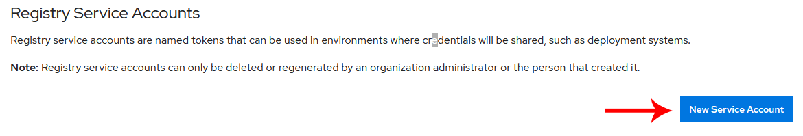
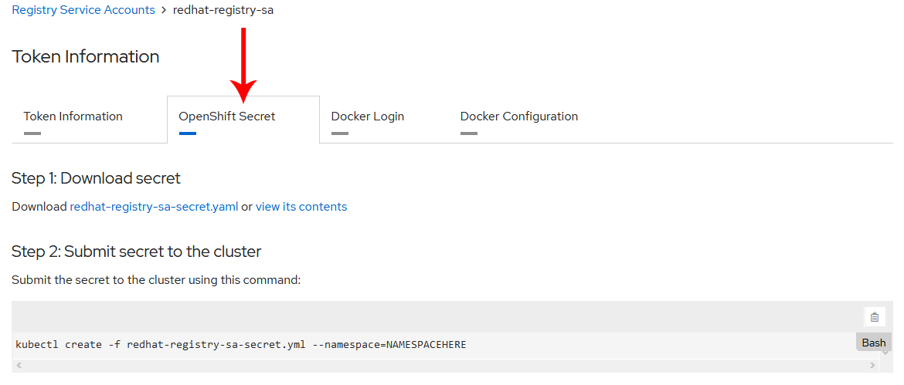

# Redhat Image Pull Service Account

In order to import the necessary Redhat docker images, you will need to create a free Redhat Developers account [here](https://access.redhat.com/terms-based-registry/).

Once you have created your Redhat account, you will have the option to create a Service Account



Once you have created the Service Account, you will have the option export service account as an OpenShift secrets object. Follow the instructions on the _"OpenShift Secret"_ tab to import it into your `tools` namespace



Now you are ready to import the necessary images. For example

```
# be sure to set reference-policy to 'local'
oc import-image rhel8/nginx-116 --from=registry.redhat.io/rhel8/nginx-116 --confirm --reference-policy='local'
```
